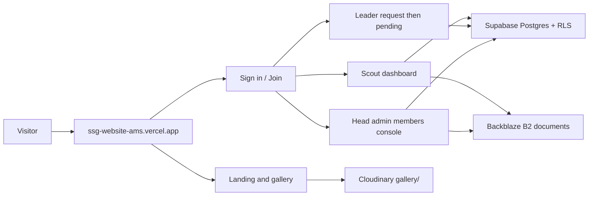
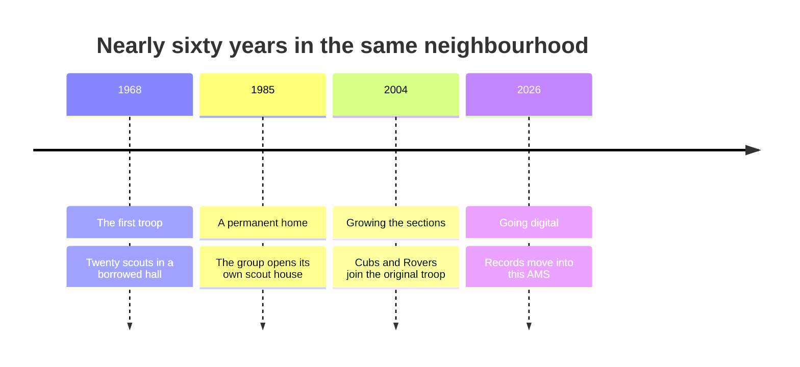

<div align="center">


<p>
  <a href="https://ssg-website-ams.vercel.app">
    
  </a>
  
  
  
</p>

<p><strong>Public portal + Association Management System</strong> for 400+ scouts, leaders and families.</p>


</div>

---

## Two products, one codebase

| Public portfolio | Internal AMS |
| --- | --- |
| Landing page, history timeline, camp gallery | Auth, onboarding, roles, member roster |
| Cloudinary albums under `gallery/` | Scout + leader registration, ID documents |
| Open to visitors | Signed-in members only |



---

## History (from the homepage)



---

## Tech stack

| Layer | Choice |
| --- | --- |
| App | Next.js 16 (App Router) + React 19 |
| Auth + DB | Supabase (PostgreSQL, RLS, Auth) |
| Gallery | Cloudinary Admin API, private-folder convention |
| Documents | Backblaze B2 (S3 API, signed URLs) |
| Hosting | Vercel |

Roles (least to most privileged): `scout` / `pending_leader` / `stage_leader` / `stage_admin` / `site_admin` / `head_site_admin`.

Pending leaders can sign in and wait. They cannot reach the dashboard until a head site admin approves them.

---

## Getting started

```bash
# Install dependencies
npm install

# Copy env vars, then fill in Supabase, Cloudinary and B2 keys
cp .env.example .env.local

# Run the App Router dev server
npm run dev
```

Open http://localhost:3000

Useful scripts:

```bash
# Production build
npm run build

# Lint
npm run lint
```

### Environment

Create `.env.local` (never commit it). Variables this repo reads:

```
NEXT_PUBLIC_SUPABASE_URL=
NEXT_PUBLIC_SUPABASE_ANON_KEY=
SUPABASE_SERVICE_ROLE_KEY=

NEXT_PUBLIC_CLOUDINARY_CLOUD_NAME=
CLOUDINARY_API_KEY=
CLOUDINARY_API_SECRET=

B2_KEY_ID=
B2_APP_KEY=
B2_BUCKET=
B2_ENDPOINT=
B2_REGION=

NEXT_PUBLIC_SITE_URL=http://localhost:3000

RESEND_API_KEY=
EMAIL_FROM=
ADMIN_NOTIFICATION_EMAILS=
```

Apply SQL in `supabase/migrations/` in order (`0001` … `0018`) in the Supabase SQL editor.

Drop camp photos in Cloudinary under `gallery/<album-name>/`. The landing page and `/gallery` pick them up on the next cache refresh (about an hour).

---

## Project map

```
app/            routes: landing, gallery, auth, dashboard, members
components/     site shell, gallery tiles, onboarding, member tables
lib/            DAL, roles, Cloudinary, B2 signed URLs, email
supabase/       numbered SQL migrations (0001 ... 0018)
public/         static assets (group logo)
```

Authorisation lives in `lib/dal.ts` and Postgres RLS. `proxy.ts` only refreshes cookies and redirects unsigned visitors.

---

<div align="center">


<p>
  <a href="https://ssg-website-ams.vercel.app/signup"><strong>Create an account</strong></a>
  &nbsp;·&nbsp;
  <a href="https://ssg-website-ams.vercel.app/login"><strong>Sign in</strong></a>
  &nbsp;·&nbsp;
  <a href="https://ssg-website-ams.vercel.app"><strong>Visit the site</strong></a>
</p>

**مجموعات السلام الكشفية** · Elsalam Scout Groups

<sub>Character, service and friendship since 1968</sub>

</div>
